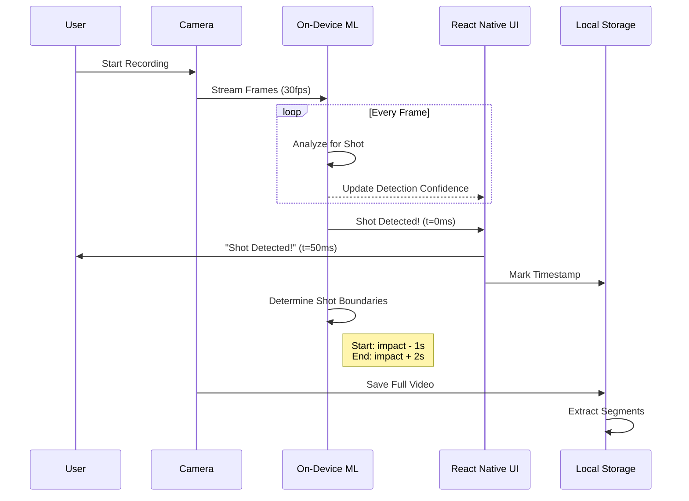
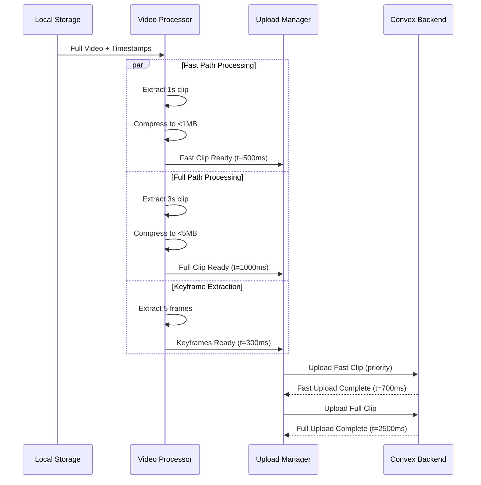
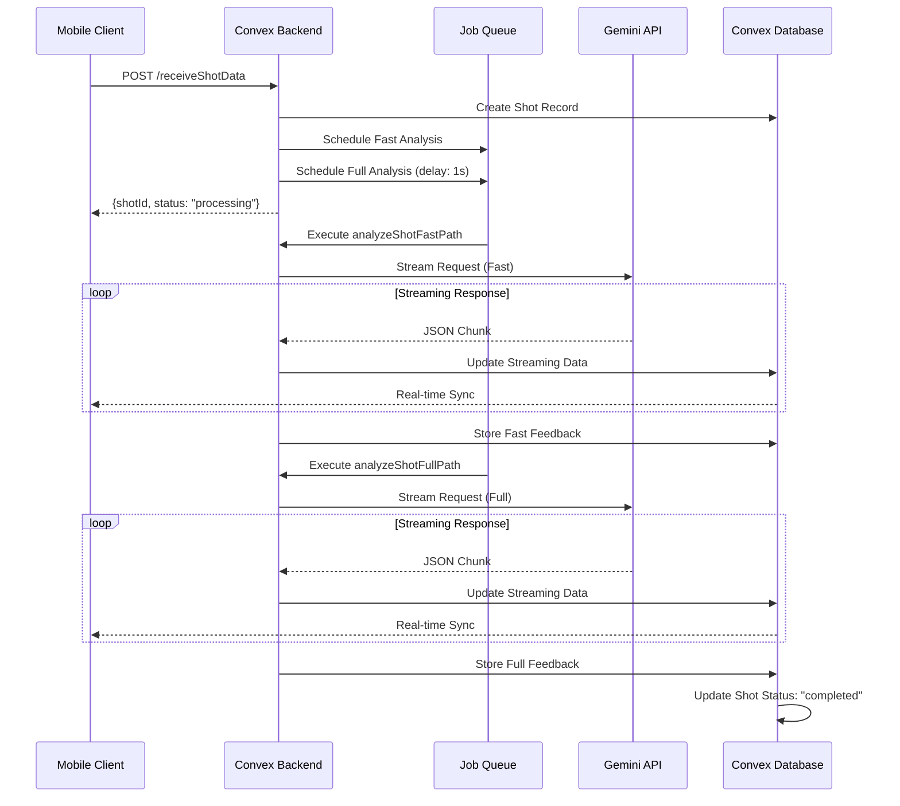
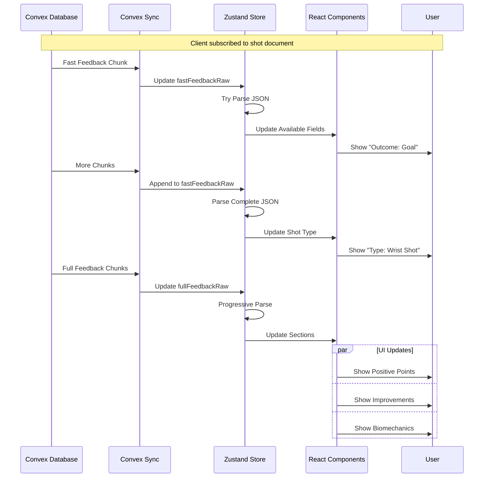

# Data Flow & Event Sequence - Smart Hockey Coach

## Complete Event Sequence

### Phase 1: Shot Capture & Detection



### Phase 2: Video Processing & Upload



### Phase 3: Backend Processing & Gemini Analysis



### Phase 4: Progressive UI Updates



## Detailed Step-by-Step Flow

### Step 1: Video Recording Initiated
```typescript
// Time: T+0ms
const startRecording = async () => {
  await camera.startRecording({
    quality: RNCamera.Constants.VideoQuality['720p'],
    maxDuration: 30,
    maxFileSize: 100 * 1024 * 1024, // 100MB
  });
  
  // Start ML monitoring
  mlProcessor.startFrameAnalysis(camera.frameStream);
};
```

### Step 2: Real-time Shot Detection
```typescript
// Time: T+0ms to T+3000ms (during recording)
const analyzeFrame = async (frame: VideoFrame) => {
  const prediction = await tfLiteModel.predict(frame);
  
  if (prediction.shotDetected && prediction.confidence > 0.8) {
    // Time: T+300ms (typical)
    onShotDetected({
      timestamp: frame.timestamp,
      confidence: prediction.confidence,
      shotType: prediction.shotType,
    });
  }
};
```

### Step 3: Immediate UI Feedback
```typescript
// Time: T+350ms
const onShotDetected = (detection: ShotDetection) => {
  // Update UI immediately
  store.setInstantFeedback(`${detection.shotType} Detected!`);
  
  // Haptic feedback
  Haptics.impactAsync(Haptics.ImpactFeedbackStyle.Medium);
  
  // Mark video segments
  videoSegments.markShotBoundaries({
    start: detection.timestamp - 1000,
    end: detection.timestamp + 2000,
    impact: detection.timestamp,
  });
};
```

### Step 4: Video Segmentation
```typescript
// Time: T+500ms to T+1500ms
const processVideo = async (videoUri: string, segments: VideoSegments) => {
  // Extract clips in parallel
  const tasks = [
    // Fast path: minimal clip
    extractClip(videoUri, {
      start: segments.impact - 500,
      duration: 1000,
      quality: 'fast',
    }),
    
    // Full path: comprehensive clip
    extractClip(videoUri, {
      start: segments.start,
      duration: segments.end - segments.start,
      quality: 'high',
    }),
    
    // Keyframes: still images
    extractKeyframes(videoUri, segments.impact),
  ];
  
  const [fastClip, fullClip, keyframes] = await Promise.all(tasks);
  return { fastClip, fullClip, keyframes };
};
```

### Step 5: Progressive Upload
```typescript
// Time: T+700ms (fast), T+2500ms (full)
const uploadManager = new UploadManager();

// Fast path gets priority
await uploadManager.uploadHighPriority({
  url: '/api/receiveShotData',
  data: {
    fastVideo: fastClip,
    shotType: detection.shotType,
    timestamp: Date.now(),
  },
  onProgress: (progress) => store.setUploadProgress('fast', progress),
});

// Full path uploads in background
uploadManager.uploadNormal({
  url: '/api/receiveShotData/full',
  data: { fullVideo: fullClip, shotId },
});
```

### Step 6: Convex Backend Processing
```typescript
// Time: T+800ms (received at backend)
export const receiveShotData = httpAction(async (ctx, request) => {
  const { fastVideo, shotType, userId } = await parseRequest(request);
  
  // Create shot record
  const shotId = await ctx.runMutation(api.shots.create, {
    userId,
    videoData: { fastPathUri: await storeVideo(fastVideo) },
    shotType,
    status: 'pending',
  });
  
  // Schedule immediate fast analysis
  await ctx.scheduler.runAfter(0, api.analysis.analyzeShotFastPath, {
    shotId,
    videoUri: fastPathUri,
  });
  
  return { shotId };
});
```

### Step 7: Gemini Streaming Analysis
```typescript
// Time: T+1000ms to T+3000ms (fast path)
const streamGeminiAnalysis = async function* (
  videoUri: string,
  prompt: string
) {
  const request = {
    contents: [{
      parts: [
        { text: prompt },
        { fileData: { fileUri: videoUri, mimeType: 'video/mp4' } }
      ]
    }],
    generationConfig: {
      maxOutputTokens: 100,
      responseMimeType: 'application/json',
    }
  };
  
  const stream = await gemini.generateContentStream(request);
  
  // Yield chunks as they arrive
  for await (const chunk of stream) {
    yield chunk.text();
  }
};
```

### Step 8: Real-time Database Updates
```typescript
// Time: T+1200ms onwards (streaming)
export const analyzeShotFastPath = action({
  handler: async (ctx, { shotId, videoUri }) => {
    let accumulated = '';
    
    for await (const chunk of streamGeminiAnalysis(videoUri, FAST_PROMPT)) {
      accumulated += chunk;
      
      // Update streaming field for real-time sync
      await ctx.runMutation(api.shots.updateStreamingData, {
        shotId,
        fastFeedbackChunk: chunk,
        timestamp: Date.now(),
      });
      
      // Try early parsing for quick updates
      tryParseAndUpdate(accumulated, shotId, ctx);
    }
  }
});
```

### Step 9: Client-Side Progressive Rendering
```typescript
// Time: T+1500ms onwards
const ShotAnalysisScreen = ({ shotId }) => {
  // Subscribe to real-time updates
  const shot = useQuery(api.shots.getWithStreaming, { shotId });
  
  // Parse streaming data progressively
  useEffect(() => {
    if (shot?.streamingData?.fastFeedbackChunk) {
      const accumulated = streamBuffer.current + shot.streamingData.fastFeedbackChunk;
      streamBuffer.current = accumulated;
      
      try {
        const parsed = JSON.parse(accumulated);
        setFastFeedback(parsed);
      } catch (e) {
        // Partial JSON, extract what we can
        extractPartialData(accumulated);
      }
    }
  }, [shot?.streamingData]);
  
  // Render progressively
  return (
    <View>
      {fastFeedback?.shot_outcome_fast && (
        <Animated.View entering={FadeIn}>
          <Text>Outcome: {fastFeedback.shot_outcome_fast}</Text>
        </Animated.View>
      )}
      {/* More progressive sections... */}
    </View>
  );
};
```

### Step 10: Complete Analysis Flow
```typescript
// Time: T+8000ms to T+15000ms (full analysis)
// Similar flow to fast path but with comprehensive prompt and longer processing
export const analyzeShotFullPath = action({
  handler: async (ctx, { shotId, videoUri }) => {
    // Full analysis with detailed feedback
    const fullAnalysis = await streamFullGeminiAnalysis(videoUri, FULL_PROMPT);
    
    // Progressive updates for each section
    await updateProgressively(ctx, shotId, fullAnalysis);
    
    // Mark completion
    await ctx.runMutation(api.shots.complete, { shotId });
  }
});
```

## Data State Transitions

### Shot Record Lifecycle
```
┌─────────────┐     ┌──────────────────┐     ┌─────────────────┐
│   Created   │ --> │ Analyzing (Fast) │ --> │ Fast Complete   │
│ status:     │     │ status:          │     │ status:         │
│ "pending"   │     │ "analyzing_fast" │     │ "fast_complete" │
└─────────────┘     └──────────────────┘     └─────────────────┘
                              │                         │
                              ▼                         ▼
                    ┌──────────────────┐     ┌─────────────────┐
                    │ Analyzing (Full) │ --> │    Complete     │
                    │ status:          │     │ status:         │
                    │ "analyzing_full" │     │ "completed"     │
                    └──────────────────┘     └─────────────────┘
```

### Feedback Data Structure Evolution
```typescript
// Initial state
{
  shotId: "shot_123",
  streamingData: {},
  fastFeedback: null,
  fullFeedback: null
}

// After fast streaming starts
{
  shotId: "shot_123",
  streamingData: {
    fastFeedbackChunk: '{"shot_outcome_fast": "Go',
    lastUpdate: 1234567890
  },
  fastFeedback: null,
  fullFeedback: null
}

// After fast complete
{
  shotId: "shot_123",
  streamingData: {
    fastFeedbackChunk: '{"shot_outcome_fast": "Goal", "shot_type_detected_fast": "Wrist Shot"}',
    lastUpdate: 1234567891
  },
  fastFeedback: {
    outcome: "Goal",
    shotType: "Wrist Shot"
  },
  fullFeedback: null
}

// Final state
{
  shotId: "shot_123",
  streamingData: { /* ... */ },
  fastFeedback: { /* ... */ },
  fullFeedback: {
    shot_outcome_full: "Goal - Top Left Corner",
    key_positive_points: ["Excellent weight transfer", "Quick release"],
    areas_for_improvement: [/* ... */],
    biomechanics_analysis: { /* ... */ },
    // ... complete analysis
  }
}
```

## Error Handling in Data Flow

### Failure Points and Recovery
1. **ML Model Failure**: Fall back to manual shot marking
2. **Video Processing Failure**: Retry with lower quality
3. **Upload Failure**: Queue for retry, use WiFi-only mode
4. **Gemini API Failure**: Show partial results, retry in background
5. **Real-time Sync Failure**: Cache locally, sync when connection restored

```typescript
const errorRecoveryStrategies = {
  ml_detection_failed: async () => {
    // Allow manual shot marking
    showManualShotMarker();
  },
  
  upload_failed: async (error, data) => {
    if (error.type === 'network') {
      // Queue for background retry
      await queueForRetry(data);
      showOfflineMessage();
    }
  },
  
  gemini_error: async (error, shotId) => {
    if (error.code === 'RATE_LIMIT') {
      // Exponential backoff
      await retryWithBackoff(shotId);
    } else {
      // Show partial results
      showPartialFeedback(shotId);
    }
  }
};
```